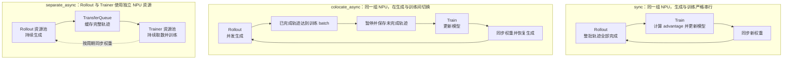
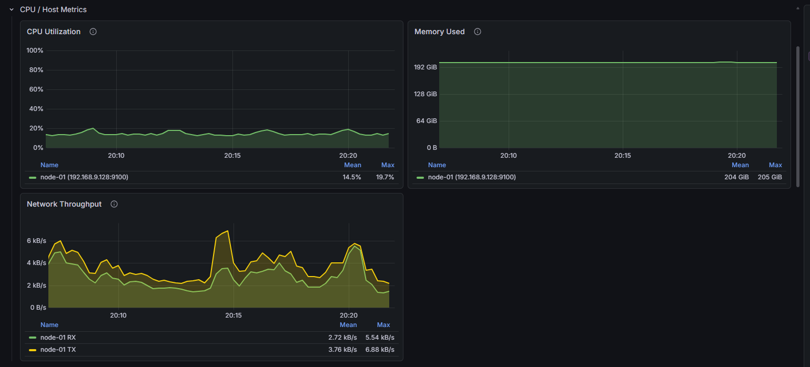
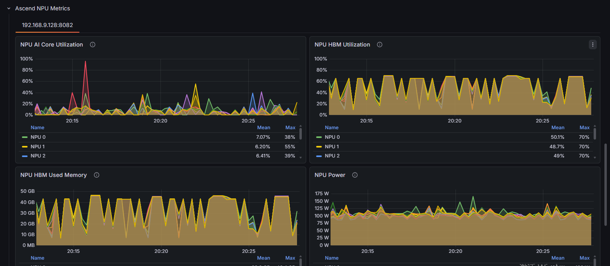
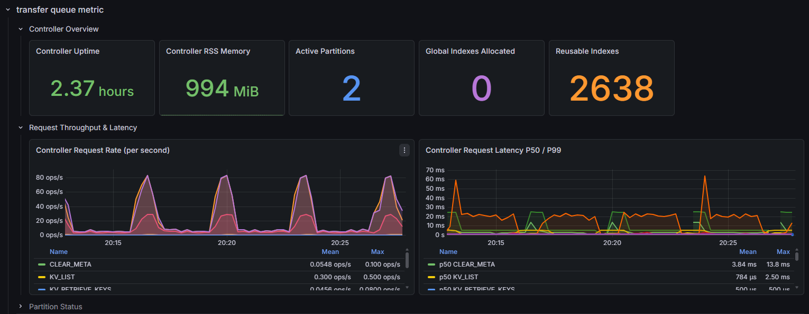

# RL-Insight：面向 RL 训练的全链路在线可观测性

大语言模型强化学习是一套由 rollout、奖励计算、策略更新、参数同步和数据传输共同组成的训练系统。一次任务通常同时运行 controller、训练 worker、推理服务和数据组件。单步时间增加或 NPU 利用率下降只是最终表现，问题可能发生在链路中的任意位置。

Agent RL 进一步增加了系统的不确定性：一条轨迹可能包含多轮模型生成、工具调用和外部环境交互，不同样本的轮数、响应长度和工具耗时并不一致。长尾轨迹会影响 rollout 批次完成时间，异步执行又会带来数据供需和样本新鲜度问题。因此，仅查看 reward、loss 或设备利用率，通常不足以解释训练系统的实际运行状态。

RL-Insight 面向这一场景提供 Online Monitor。它将 RL state timeline、Trainer 标量、vLLM/SGLang 引擎指标、CPU/NPU 硬件指标和 TransferQueue 指标汇总到 Grafana，在同一 experiment 和时间范围内观察训练、推理、硬件资源及数据通路。与只展示结果标量的实验看板相比，RL-Insight 更关注一个问题：**系统为什么在这个时刻变快、变慢或等待？**

> 本文基于 verl 与 RL-Insight 截至 2026 年 7 月的代码和文档。文中的看板截图来自示例任务，用于说明指标覆盖范围和关联分析方式，不作为硬件、模型或集群的性能基准。

## Trainer V1 的三种运行模式

先用一轮 RL 训练说明 Trainer 在做什么。Trainer 从数据集中取出一批 prompt，rollout 引擎使用当前策略模型生成 response；随后计算 reward、log probability 和 advantage，最后更新 actor，部分算法还会更新 critic。actor 可以简单理解为正在训练的策略模型，advantage 表示一条 response 相对预期“好多少”。模型更新完成后，新权重需要同步给 rollout 引擎，下一轮生成才能使用新策略。

在严格的 on-policy 训练中，当前 step 使用的轨迹应由当前版本的策略生成。实际任务中，不同 response 的生成时间并不一致，Agent RL 还会受到多轮交互和工具调用影响。如果每次都等待整批轨迹全部结束，少量长尾样本就会延迟整个训练 step。Trainer V1 的三种模式，本质上是在“策略新鲜度、长尾等待、资源占用和流水并行”之间做不同取舍。

*图 1　Trainer V1 三种模式的资源与执行关系。图根据 `trainer_sync.py`、`trainer_colocate_async.py` 和 `trainer_separate_async.py` 的当前实现整理。*

### Sync：完整轨迹、严格串行

`sync` 中，Trainer 与 rollout 使用同一组 NPU 资源。系统先完成整批 rollout，再切换到 log probability、advantage 和模型更新，最后将新权重同步回 rollout 引擎。一个 step 内生成和训练不会重叠。

这种方式最接近标准 on-policy 定义：用于训练的轨迹来自同一个当前策略版本，行为清晰，适合作为算法基线。代价是必须等待整批轨迹完成。只要有少量长 response 或 Agent 长尾轨迹，其他已经完成生成的资源也无法提前进入训练。

### Colocate Async：共享资源、保留未完成轨迹

`colocate_async` 仍由 rollout 和 Trainer 共享同一组 NPU，因此生成与模型更新不能长期并行。区别在于 rollout 采用异步请求和 partial rollout：当已经完成的轨迹足以组成训练 batch 时，可以暂停尚未结束的请求，切换到模型更新；权重同步完成后，再恢复未完成轨迹。

这种模式减少了每个 step 等待最慢轨迹的时间，同时保持共置部署的资源效率。需要关注的是，同一条长轨迹可能在暂停前后使用不同版本的模型参数，因此会出现 trajectory spans 和 staleness。权重更新、引擎 sleep/resume 的切换开销也会直接影响收益。

### Separate Async：资源分离、生成训练并行

`separate_async` 为持续 rollout 配置独立资源，Trainer 使用另一组资源执行模型更新。完整轨迹通过 TransferQueue 进入训练侧；Trainer 训练的同时，rollout 资源仍可继续生成，新权重按照配置的周期同步给 rollout 侧。

这种方式能够把生成与训练组成流水线，更适合 rollout 占比较高、长尾明显的 Agent RL 任务。它也引入了更明显的生产消费关系：rollout 太慢时 Trainer 会等数据，rollout 太快时队列中的样本会逐渐变旧。资源配比、参数同步周期和样本 staleness 需要一起调整。

| 模式 | NPU 资源组织 | 轨迹特点 | 主要取舍 |
| --- | --- | --- | --- |
| `sync` | rollout 与 Trainer 共用一组资源 | 整条轨迹由同一策略版本生成 | on-policy 清晰，但受整批长尾阻塞 |
| `colocate_async` | 共用一组资源，在生成/训练间切换 | 未完成轨迹可暂停和恢复，可能跨参数版本 | 减少长尾等待，同时关注切换开销和轨迹跨版本 |
| `separate_async` | rollout 与 Trainer 使用独立资源 | 生成与训练并行，允许消费较早版本轨迹 | 提升流水并行度，同时关注资源配比和样本陈旧度 |

三种模式对应的监控重点也不同：`sync` 关注阶段耗时和空档，`colocate_async` 关注暂停/恢复与 trajectory spans，`separate_async` 关注生成训练重叠、TransferQueue 数据供需和 trajectory staleness。

## RL-Insight 在线监控架构

RL-Insight 在训练侧接收指标和状态 trace，在服务侧管理 Prometheus、Tempo 和 Grafana。Trainer 产生的数值型标量和状态区间通过 RL-Insight 上报；vLLM、SGLang、TransferQueue 以及硬件监控组件暴露 Prometheus endpoint，由服务端统一采集。

*图 2　RL-Insight Online Monitor 架构。Trainer 指标、RL state trace 和子系统 metrics endpoint 在服务侧汇总，并由 Grafana 统一展示。图源：[RL-Insight](https://github.com/verl-project/rl-insight)。*

Prometheus 保存和查询指标，Tempo 保存状态 trace，Grafana 提供预置看板。它们共同构成 RL-Insight 的在线监控视图，使训练阶段、推理性能、硬件资源和数据通路能够按同一时间范围联动排查。

## RL state timeline

RL state timeline 是 RL-Insight 区别于常规训练指标看板的主要能力。它记录带起止时间的状态区间，并按训练 rank 和 rollout replica 展开。当前 verl 看板可以显示 `actor_compute_log_prob`、`ref_compute_log_prob`、`actor_update` 和 `vllm_generate`/`sglang_generate` 等状态。

### Sync 模式

*图 3　Trainer V1 `sync` 模式状态时间线。训练 rank 与 rollout replica 按 step 交替执行。图源：[verl RL-Insight 使用文档](https://github.com/verl-project/verl/blob/2527f29b99924577d2ab54ac3ce3830a32344ebe/docs/advance/rl_insight.md)。*

图 3 中，各训练 rank 的 log probability 和 actor update 基本对齐，rollout generate 与训练更新按 step 交替出现。

**能看什么：**各阶段的开始时间、持续时间、rank 间同步关系，以及 generate 与模型更新之间的空档。

**典型问题：**同步任务单步变慢时，可以先判断时间增加发生在 rollout、log probability、actor update，还是阶段间等待，再进入对应模块排查。

### Separate Async 模式

*图 4　Trainer V1 `separate_async` 模式状态时间线。独立 rollout replica 持续生成，训练 rank 同时执行 actor update。图源：[verl RL-Insight 使用文档](https://github.com/verl-project/verl/blob/2527f29b99924577d2ab54ac3ce3830a32344ebe/docs/advance/rl_insight.md)。*

图 4 显示了 rollout 与模型更新的重叠关系。Grafana 支持查看单个状态区间的开始时间和持续时间。

**能看什么：**异步流水线是否真正形成重叠、哪些 rollout replica 处于运行状态，以及训练侧是否存在持续等待。

**典型问题：**异步模式收益不明显时，可以先检查时间线是否仍接近串行；若重叠充分，则继续结合 trajectory staleness 和 TransferQueue 指标判断是否存在样本陈旧或数据供需问题。

`colocate_async` 同样可以使用状态时间线观察 generate 与模型更新的关系，重点检查未完成请求的中断、恢复是否形成额外空档。

## Trainer 指标

reward、loss、KL、gradient norm、样本长度和阶段耗时等 Trainer 标量并不是 RL-Insight 独有能力。verl 的 console、W&B、SwanLab、MLflow、TensorBoard、Trackio 等 logger 也可以记录这些数据，并且更适合实验管理和多次训练结果对比。

RL-Insight 的作用是将 Trainer 指标与 state timeline、推理引擎和 TransferQueue 放到同一时间范围内。训练指标发生变化时，可以直接检查同一时刻的系统状态，而不需要在多个平台之间手动对齐时间。

当前预置看板覆盖的 Trainer 指标主要包括：

| 指标类型 | 代表指标 | 主要用途 |
| --- | --- | --- |
| 训练状态 | reward、score、loss、KL、entropy、gradient norm | 判断策略更新是否稳定 |
| 样本组成 | prompt/response length、aborted ratio、`num_turns` | 判断工作量和 Agent 轨迹长尾是否变化 |
| 阶段耗时 | `timing_s/*`、`timing_per_token_ms/*` | 定位 gen、ref、adv、actor update、update weights 等阶段耗时 |
| 吞吐与资源 | time per step、token throughput、MFU、内存使用 | 观察整体训练效率和资源状态 |
| 异步新鲜度 | trajectory staleness/spans、dropped samples | 判断轨迹落后当前策略的程度 |

**能看什么：**模型训练状态、每步数据量、各阶段耗时、吞吐以及异步样本新鲜度。RL-Insight 写入 Prometheus 时会将 metric key 中的 `/` 转换为 `_`，例如 `critic/rewards/mean` 对应 `critic_rewards_mean`。

**典型问题：**单步时间上升时，如果 `num_turns` 或 response length 同时增加，通常需要先检查样本复杂度；如果样本组成稳定但 `timing_s/update_actor` 增长，则可以将范围收敛到模型更新阶段。异步任务训练波动时，可以联看 reward、KL 与 trajectory staleness，判断性能收益是否伴随过高的 off-policy 程度。

## 硬件指标

训练阶段耗时和推理延迟最终都运行在具体节点与设备上。RL-Insight 将 CPU/Host 和 Ascend NPU 指标纳入同一 Grafana 时间范围，避免在训练看板、节点监控和设备工具之间手工对时。硬件面板的价值不是单独判断“利用率高不高”，而是将资源变化与 state timeline、Trainer 阶段、推理吞吐及 TransferQueue 请求同步观察。

### CPU / Host

*图 5　CPU / Host 指标面板，覆盖节点 CPU 利用率、内存占用和网络收发吞吐。截图来自示例任务，仅用于展示指标维度。*

CPU / Host 面板提供节点级资源基线：

| 指标 | 观察重点 | 可辅助判断 |
| --- | --- | --- |
| CPU Utilization | 当前值、均值、峰值及阶段性波动 | controller、数据处理或调度逻辑是否出现 CPU 压力 |
| Memory Used | 常驻占用、持续增长和突增 | 进程内存是否稳定，是否存在缓存累积或内存泄漏迹象 |
| Network Throughput | RX/TX 的趋势、峰值和方向差异 | 权重同步、样本传输或远端依赖是否形成网络压力 |

### Ascend NPU

*图 6　Ascend NPU 指标面板，按设备展示 AI Core 利用率、HBM 利用率与已用显存、NPU 功耗等信息。截图来自示例任务，仅用于展示指标维度。*

NPU 面板用于回答“设备是否真正忙在有效计算上”：

| 指标 | 观察重点 | 可辅助判断 |
| --- | --- | --- |
| NPU AI Core Utilization | 各卡均值、峰值和卡间差异 | 计算负载是否充分，是否存在单卡掉队或负载不均 |
| NPU HBM Utilization | 带宽利用趋势与阶段性峰值 | 当前阶段是否更接近内存带宽受限 |
| NPU HBM Used Memory | 各卡显存占用、波动和余量 | 模型、KV Cache 与批量配置是否带来显存压力 |
| NPU Power | 功耗基线、突降和设备间差异 | 低利用率是否伴随设备空闲，异常卡是否偏离集群基线 |

**能看什么：**节点 CPU、内存、网络以及每张 NPU 的计算、HBM 和功耗状态，并通过 Grafana 的相同时间选择器与训练、推理和 TransferQueue 面板对齐。

**典型问题：**当 `actor_update` 变慢时，如果 AI Core 利用率同步下降而 CPU 或网络升高，优先检查数据准备、调度或通信等待；如果 AI Core 利用率保持高位且 HBM 利用率明显抬升，则进一步分析内存访问和算子行为。rollout 延迟升高但 NPU 利用率偏低时，应联看请求到达、KV Cache、TransferQueue 供给和 replica 负载，而不是直接归因于设备算力不足。

## Rollout 引擎指标

RL-Insight 汇总 vLLM 和 SGLang 暴露的推理指标，并按 rollout replica 添加标签。预置看板包含 Prompt/Generation Token Throughput、TTFT、TPOT 和 Cache Utilization 等指标。

*图 7　多个 vLLM rollout replica 的吞吐、TPOT、TTFT 和 Cache Utilization。图源：[verl RL-Insight 使用文档](https://github.com/verl-project/verl/blob/2527f29b99924577d2ab54ac3ce3830a32344ebe/docs/advance/rl_insight.md)。*

**能看什么：**整体及各 replica 的输入/输出 token 吞吐、首 token 延迟、逐 token 延迟和 KV Cache 使用情况。

**典型问题：**rollout 变慢时，可以先区分所有 replica 同时变化，还是单个副本偏离。单副本异常通常继续检查请求分布、路由和对应节点；所有副本同步变化时，则优先检查输入长度、采样配置和公共依赖。Agent RL 的多轮请求到达时间并不均匀，按 replica 查看曲线也有助于识别负载不均和长尾集中。

## TransferQueue 指标

TransferQueue 承担 Trainer V1 中生成、奖励计算和模型训练等阶段的数据流转，尤其是 `separate_async` 模式下连接 rollout 生产侧与 Trainer 消费侧的关键数据通路。RL-Insight 看板将 Controller 健康度、partition/index 状态、操作吞吐和延迟分位数放在同一视图中。

*图 8　TransferQueue Controller Overview、请求速率和 P50/P99 延迟。截图来自示例任务，仅用于展示指标维度。*

TransferQueue 面板覆盖四类信号：

| 观测域 | 代表指标 | 主要用途 |
| --- | --- | --- |
| Controller 健康度 | uptime、RSS memory | 识别服务重启、常驻内存增长和控制面异常 |
| 分区与索引 | active partitions、allocated/reusable indexes | 判断分区工作状态和索引资源是否健康复用 |
| 请求吞吐 | 按 task、operation type 统计 request rate | 区分生产不足、消费放缓与特定操作突增 |
| 请求延迟 | 各操作的 P50/P99 latency | 同时观察常态延迟和尾部抖动，识别慢操作类型 |

**能看什么：**Controller 是否稳定、内存是否持续增长、活跃分区和索引资源是否健康，以及不同 task 和 operation type 的请求速率与 P50/P99 延迟。通过看板变量还可以按任务、操作类型和延迟分位筛选，缩小排查范围。

**典型问题：**Trainer 等待数据时，可以将 TransferQueue request rate、P99 与状态时间线对齐。如果请求速率下降但延迟稳定，优先检查 rollout 生产节奏；如果特定操作的 P99 升高，应继续检查 Controller、分区状态或存储后端，并联看 CPU、内存与网络；如果队列指标稳定，则问题更可能位于 Trainer 消费端。对于 `separate_async`，还应同时观察 trajectory staleness，避免仅通过扩大队列掩盖样本陈旧度问题。

## 在 verl 中使用 RL-Insight

- 集成 PR：[verl-project/verl#6680](https://github.com/verl-project/verl/pull/6680)
- 使用文档：[Use RL-Insight to Monitor Training](https://github.com/verl-project/verl/blob/2527f29b99924577d2ab54ac3ce3830a32344ebe/docs/advance/rl_insight.md)
- RL-Insight Quick Start：[docs/monitor/quick_start.md](https://github.com/verl-project/rl-insight/blob/main/docs/monitor/quick_start.md)
- 服务端安装说明：[docs/monitor/server_installation.md](https://github.com/verl-project/rl-insight/blob/main/docs/monitor/server_installation.md)

## 工具定位

RL-Insight 用于训练任务的在线监控和跨组件关联，能够提供节点与 NPU 设备级资源趋势，但不替代算子级 profiler，也不提供 HCCL 通信明细和底层流水线时间轴。当问题已经从在线指标收敛到模型更新中的某个算子、通信阶段或 NPU 内存访问行为时，需要进一步使用 `torch_npu.profiler` 采集数据，并通过 MindStudio Insight 分析。

verl 的 NPU profiling 使用方法可参考：[Profiling 采集指导](https://github.com/verl-project/verl/blob/main/docs/ascend_tutorial/dev_guide/performance/ascend_profiling_zh.rst) 和 [Ascend 性能分析指南](https://github.com/verl-project/verl/blob/main/docs/ascend_tutorial/dev_guide/performance/ascend_performance_analysis_guide.md)。
