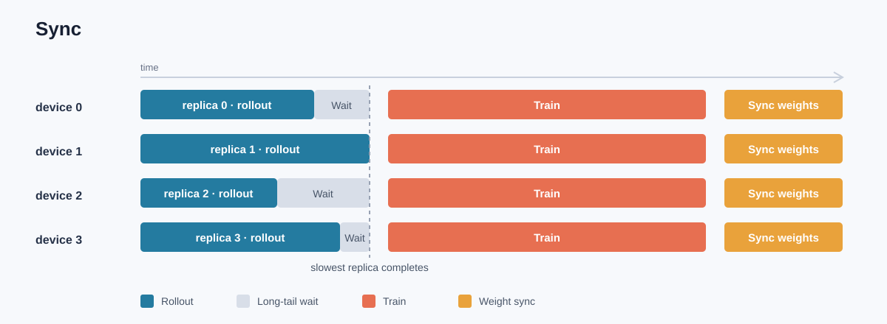
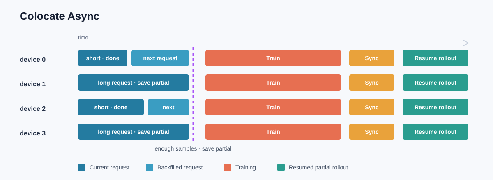
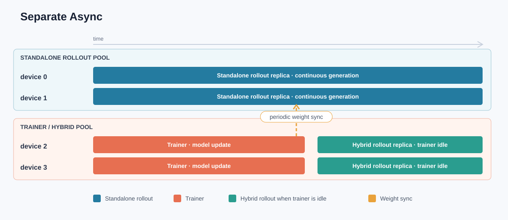

# RL-Insight：面向 RL 训练的全链路在线可观测性

## 1. 引言：RL 训练是一套复杂的在线系统

&emsp;&emsp;大语言模型强化学习并不是单一的模型训练过程。一次训练任务同时包含 rollout、奖励计算、策略更新、参数同步和数据传输，还需要 controller、训练 worker、推理服务、数据队列等多个组件协同运行。随着模型规模和集群规模扩大，计算资源可以采用共置、分离、同步、异步等不同排布，组件之间的执行关系也随之变化。

<p align="center">
&emsp;&emsp;  
</p>
<p align="center"><sub>图 1　来源于 verl 的两种典型 RL 训练资源排布：Sync 与 Fully Async</sub></p>

&emsp;&emsp;Agent RL 让这套系统更加动态。一条轨迹可能经历多轮生成、工具调用和外部环境交互，不同样本的轮数、长度和响应时间并不一致。训练系统既要处理长尾请求，又要平衡生成与训练的资源，还要控制异步流水中的数据供需和样本新鲜度。算法、调度、推理、通信、数据和 device 共同决定了任务的实际运行状态。

<p align="center">
&emsp;&emsp;  
</p>
<p align="center"><sub>图 2　Agent RL 中的多轮生成、工具调用与外部环境交互</sub></p>

&emsp;&emsp;提升整套 RL 系统的可观测性，形成高效的调试与调优路径，已经成为复杂训练任务的关键需求。现有日志系统和 profiler 覆盖了不同层次的分析需求，但在全局关联与局部深挖之间仍存在断层。

&emsp;&emsp;W&B、TensorBoard 等日志系统能够记录 reward、loss、step time 和关键事件，适合观察训练趋势与框架层面的运行结果。这类指标主要由 verl 统一汇总，难以完整呈现 rollout、奖励、数据队列和各推理 replica 的内部状态，也难以在同一时间线上还原跨组件的执行关系。

<p align="center">
&emsp;&emsp;  
</p>
<p align="center"><sub>图 3　日志系统展示的训练趋势与框架层指标</sub></p>

&emsp;&emsp;Profiler 能够深入算子、通信、内存和 device 执行细节，适合对已经收敛的局部问题做精细分析。面对多轮 Agent 和长序列任务时，采集窗口、数据规模与分析范围会迅速扩大，从全局现象直接进入 profiler 的调试成本很高。

<p align="center">
&emsp;&emsp;  
</p>
<p align="center"><sub>图 4　Profiler 面向算子、通信与内存的细粒度分析</sub></p>

&emsp;&emsp;日志系统与 profiler 之间还需要一层持续在线的系统观测能力。它先建立 RL 全局观测视图，将异常收敛到具体组件和实例，例如某个推理 replica 或某个数据传输异常的 Host IP；在范围明确后，再采集对应进程和时间窗口的 profiler 数据，形成从全局发现、组件定位到局部深挖的完整分析链路。

## 2. verl 与 Trainer V1：重构 RL 训练流水

&emsp;&emsp;[verl](https://github.com/verl-project/verl) 是面向大语言模型强化学习的开源训练框架。它将策略训练、rollout、奖励计算和分布式资源编排组织在同一套训练流程中，并支持 FSDP、Megatron、VeOmni 等训练后端，以及 vLLM、SGLang、TensorRT-LLM 等推理后端。

&emsp;&emsp;随着 RL 任务从单轮生成走向多轮 Agent 交互，训练系统需要同时处理不规则生成、长尾轨迹、弹性资源排布和异步数据流。verl 当前正在将训练流程重构到 Trainer V1，以统一的组件接口组织不同训练后端、推理后端和执行模式。

### 2.1 Trainer V1 的核心组件

&emsp;&emsp;Trainer V1 仍由单个 `PPOTrainer` 编排全局计算图，但模型计算、轨迹生成、奖励计算、数据传输和参数同步分别交给独立组件完成：

| 组件 | 主要职责 | 设计收益 |
| --- | --- | --- |
| **PPOTrainer** | 编排采样、奖励、log probability、advantage、actor/critic 更新和验证 | 保留单控制器下清晰、灵活的 RL 算法表达 |
| **ResourcePool / WorkerGroup** | 拉起 actor、critic、reference 等角色，并在 FSDP、Megatron、VeOmni 后端上执行分布式计算 | 将资源排布和并行策略封装在模型执行层 |
| **LLMServerManager / AgentLoopManager** | 管理 rollout server，分发逐样本生成请求并执行多轮 Agent 逻辑 | 利用动态 batching 和多 replica 负载分发，并解耦 Agent 逻辑与推理后端 |
| **RewardLoopManager** | 统一调用规则奖励或模型奖励，可按配置共置或独立部署 | 将奖励计算从 Trainer 主流程中解耦 |
| **TransferQueue / ReplayBuffer** | 按轨迹保存数据与状态，筛选可训练 batch，并控制样本陈旧度 | 将控制流与大规模数据流分开，支撑异步生产消费 |
| **CheckpointEngineManager** | 在训练 worker 与 rollout replica 之间同步策略权重，并管理 replica 的 sleep、resume 和 abort | 统一不同训练、推理后端之间的参数同步和模式切换 |

&emsp;&emsp;这些组件组成一条统一的训练流水。PPOTrainer 负责全局编排，WorkerGroup 承担模型计算，AgentLoopManager 和 RewardLoopManager 分别处理轨迹与奖励，TransferQueue 和 ReplayBuffer 连接数据生产与消费，CheckpointEngineManager 则维持训练模型与 rollout replica 之间的参数版本关系。

### 2.2 三种运行模式

&emsp;&emsp;三种模式复用同一套 `PPOTrainer.step()`，差异集中在采样前后和 step 结束时的生命周期钩子。它们改变的是 rollout 与训练的资源关系、未完成请求的处理方式以及参数同步节奏。

#### 2.2.1 Sync

&emsp;&emsp;`sync` 将 Trainer 与 rollout 共置在同一组 device 资源上，并关闭 partial rollout。Trainer 等待当前 batch 的轨迹完成，随后让 rollout replica 进入 sleep，释放相关权重和 KV Cache，再执行 log probability、advantage 和模型更新。step 结束时，新权重立即同步回 rollout replica。

&emsp;&emsp;这种模式的轨迹来自同一策略版本，执行边界清晰，适合作为严格 on-policy 基线。代价是整批采样速度由最慢轨迹决定，长 response、多轮工具调用和外部环境等待都会直接拉长 step。

<p align="center"></p>
<p align="center"><sub>图 5　Sync 模式：不同 rollout replica 的生成时长不一致，短任务完成后需要等待最慢 replica，随后所有 device 统一进入训练和权重同步</sub></p>

#### 2.2.2 Colocate Async

&emsp;&emsp;`colocate_async` 仍然共享 Trainer 与 rollout 的 device 资源，但使用 `FullyAsyncLLMServerClient` 和预热 batch，让多个生成批次提前进入 AgentLoop。ReplayBuffer 收集到足够样本后，Trainer 会 abort 并保存未完成请求，使 rollout replica sleep；模型更新及权重同步完成后，再 resume generation，继续推进未完成轨迹。

&emsp;&emsp;这种模式并不改变轨迹本身长短不一的事实，而是通过异步补位和 partial rollout 消除长度差异造成的整批等待：短请求完成后可以继续处理新请求，已完成样本达到训练 batch 后即可切换到训练，未完成的长请求则保存并在权重更新后恢复。轨迹可能跨越一次或多次权重更新，因此 ReplayBuffer 同时负责统计和约束 trajectory spans、staleness，并按配置对过旧样本执行 `drop` 或 `wait`。

<p align="center"></p>
<p align="center"><sub>图 6　Colocate Async 模式：短请求完成后立即补入新请求，样本达到训练 batch 后保存长请求的 partial 状态并切换到训练，避免等待最慢 replica</sub></p>

#### 2.2.3 Separate Async

&emsp;&emsp;`separate_async` 额外拉起独立的 standalone rollout server，生成与 Trainer 更新可以持续并行。轨迹通过 TransferQueue 进入 ReplayBuffer，Trainer 消费已完成样本；`CheckpointEngineManager` 使用 NCCL、NIXL 等非 naive 后端，按照 `parameter_sync_step` 将权重同步到独立 rollout replica。启用模型奖励时，reward model 也需要独立资源，避免与持续运行的 rollout 争用内存。

&emsp;&emsp;这种模式将 rollout 生产侧和 Trainer 消费侧分开，适合生成占比高、长尾明显的大规模任务。它提升了流水并行度，也引入了更强的数据供需关系：生成不足会使 Trainer 等待，生成过快会积累旧轨迹，参数同步周期则直接影响吞吐与 off-policy 程度。

<p align="center"></p>
<p align="center"><sub>图 7　Separate Async 模式：standalone rollout 持续生成，Trainer 空闲时其资源可切换为 hybrid rollout replica</sub></p>

| 模式 | 资源组织 | 请求与数据行为 | 参数同步 |
| --- | --- | --- | --- |
| `sync` | Trainer 与 rollout 共置 | 等待当前 batch 完成，不保留 partial rollout | 每个 step 同步 |
| `colocate_async` | Trainer 与 rollout 共置 | 预取生成；训练前保存未完成轨迹，训练后恢复 | 每个 step 同步后 resume |
| `separate_async` | Trainer 与 standalone rollout 分离 | 生成与训练并行，经 TransferQueue 和 ReplayBuffer 解耦 | 按 `parameter_sync_step` 周期同步 |

### 2.3 组件化带来的收益与观测难题

&emsp;&emsp;Trainer V1 将训练后端、推理服务、数据通路和权重同步组织成可组合组件。同一套训练逻辑可以切换资源排布和异步程度，控制流只传递指令与元数据，大体量轨迹由 TransferQueue 承载，ReplayBuffer 则为异步训练提供明确的样本选择和新鲜度边界。

&emsp;&emsp;组件化也扩大了运行时状态空间。一次 step 可能跨越多个 WorkerGroup、rollout replica、队列分区和 device；生成与更新可能重叠，轨迹可能跨参数版本，权重同步和 replica 切换也会产生空档。Trainer V1 的可观测性重点不再是某个组件是否正常，而是这些组件在同一时刻如何协同。

## 3. RL-Insight：把训练全链路放到同一时间轴

&emsp;&emsp;随着 RL 系统的组件和运行模式不断复杂化，Ascend 在 verl 社区的 [RL-Insight](https://github.com/verl-project/rl-insight) 仓库中开发了一套面向 RL 训练的在线观测系统。它不替代实验管理工具和 profiler，而是补齐训练运行期间的系统视角：将 Trainer、rollout server、TransferQueue 和 device 等组件产生的指标与状态汇总到统一看板，并以同一个 experiment 和时间范围进行关联。

<p align="center"></p>
<p align="center"><sub>图 8　RL-Insight Online Monitor 架构。各组件的指标和状态在服务侧汇总，并由 Grafana 统一展示。图源：RL-Insight</sub></p>

### 3.1 RL state timeline

&emsp;&emsp;RL state timeline 记录训练 rank 和 rollout replica 上各状态的开始时间与持续时间，覆盖 rollout generation、old/reference log probability、advantage、actor/critic update 和参数同步等阶段。它将标量指标还原为执行区间，用于观察阶段先后、rank 间对齐、生成与训练重叠以及阶段间空档。

&emsp;&emsp;`sync` 模式下，时间线呈现 rollout 与训练的串行切换；`colocate_async` 模式下，可以看到未完成请求的 abort、sleep 和 resume 是否带来额外空档；`separate_async` 模式下，则可以直接判断 standalone rollout 与模型更新是否形成稳定流水。

<p align="center"></p>
<p align="center"><sub>图 9　Trainer V1 Sync 模式状态时间线。训练与 rollout 按 step 交替执行</sub></p>

<p align="center"></p>
<p align="center"><sub>图 10　Trainer V1 Separate Async 模式状态时间线。rollout replica 持续生成，训练 rank 同时执行模型更新</sub></p>

### 3.2 Trainer 指标

&emsp;&emsp;这部分指标来自 verl 本身的 Trainer 埋点。训练结果包括 reward、score、loss、KL、entropy 和 gradient norm；样本特征包括 prompt/response length、`num_turns`、aborted ratio 和 trajectory staleness；运行效率包括 step time、各阶段 `timing_s/*`、token throughput 和 MFU。W&B、TensorBoard、SwanLab 等日志系统也能够查看其中的大部分训练标量。

&emsp;&emsp;这些指标用于区分算法波动、样本变化和系统开销。例如 step time 增长同时伴随 response length 或 `num_turns` 上升，说明工作量发生了变化；样本组成稳定而 `timing_s/update_actor` 增长，则可以将范围收敛到模型更新阶段。RL-Insight 将这些标量放到 state timeline 的同一时间范围内，避免只看到结果变化而缺少执行上下文。

### 3.3 Rollout server 指标

&emsp;&emsp;RL-Insight 汇总 vLLM 和 SGLang rollout server 暴露的指标，并为每个 replica 添加标签。核心指标包括 Prompt/Generation Token Throughput、TTFT、TPOT、KV Cache Utilization、运行请求数和等待请求数。

&emsp;&emsp;按 replica 展开后，可以区分全局变化与单副本偏离。所有 replica 的吞吐同时下降，通常需要结合输入长度、请求到达和公共依赖继续分析；单个 replica 的 TTFT、TPOT 或等待队列明显偏高，则更接近请求分配、节点状态或负载不均。对多轮 Agent 而言，请求并非一次性到达，这组指标也能反映工具调用返回后形成的突发流量。

### 3.4 TransferQueue 指标

&emsp;&emsp;TransferQueue 指标覆盖 Controller 健康度、partition/index 状态、不同 task 与 operation 的 request rate，以及 P50/P99 latency。它描述了 rollout、奖励计算和训练之间的数据通路，也是 `separate_async` 模式下观察生产消费关系的主要入口。

&emsp;&emsp;Trainer 长时间停留在采样阶段时，可以将 ReplayBuffer 状态与 TransferQueue request rate 对齐：请求速率下降而延迟稳定，更接近 rollout 供给不足；特定操作 P99 上升，则需要检查 Controller、分区、存储或网络；队列持续积压并伴随 trajectory staleness 增长，说明生成吞吐已经超过 Trainer 的消费能力。

### 3.5 Host 与 device 指标

&emsp;&emsp;Host 指标包括 CPU utilization、memory used 和 network throughput，用于观察 controller 调度、数据处理、权重同步及样本传输带来的节点压力。device 指标包括计算利用率、显存占用、内存带宽和功耗，用于判断某个训练或生成阶段是否真正落在有效计算上，以及不同 device 之间是否存在负载差异。

&emsp;&emsp;资源指标不能脱离阶段单独解读。`actor_update` 期间 device 利用率下降而 CPU 或网络升高，更接近数据准备、调度或通信等待；rollout 延迟上升但 device 利用率偏低，则需要同时检查请求到达、KV Cache、replica 负载和 TransferQueue 供给。

### 3.6 跨组件关联

&emsp;&emsp;RL-Insight 的价值不在于增加一组孤立指标，而在于用统一时间范围连接这些信号。Trainer 等待数据时，可以同步查看 TransferQueue 的请求速率和尾延迟；rollout 延迟变化时，可以对比各 replica 的吞吐、KV Cache 和 device 状态；异步训练收益不明显时，可以检查生成与训练的重叠程度，并结合 trajectory staleness 判断流水并行是否引入了过高的数据陈旧度。

&emsp;&emsp;这套关联关系把“训练发生了波动”进一步收敛为“波动出现在哪个阶段、涉及哪些组件、当时资源和数据处于什么状态”，再由 profiler 对已经收敛的局部问题进行深入分析。

## 4. 使用流程

&emsp;&emsp;RL-Insight 由监控服务端和 verl 训练侧两部分组成。服务端负责运行 Prometheus、Tempo 和 Grafana，训练侧负责上报指标、注册数据源和发送状态 trace。

### 4.1 安装并启动 RL-Insight

&emsp;&emsp;在用于部署监控服务的机器上安装 RL-Insight：

```bash
pip install "git+https://github.com/verl-project/rl-insight.git"
```

&emsp;&emsp;安装并启动监控组件：

```bash
rl-insight server install
rl-insight server start
```

&emsp;&emsp;启动命令会输出 RL-Insight 服务地址和 Grafana 地址。默认端口如下：

| 服务 | 默认端口 | 作用 |
| --- | --- | --- |
| RL-Insight server | `18080` | 接收指标与 trace 注册 |
| Prometheus | `9090` | 存储和查询指标 |
| Tempo | `3200` | 存储状态 trace |
| Grafana | `3000` | 展示预置看板 |

&emsp;&emsp;受限网络环境可以提前下载 Prometheus、Tempo 和 Grafana 安装包，再使用 `rl-insight server install --local-archive <archive-dir>` 完成离线安装。

### 4.2 在 verl 中启用 RL-Insight

&emsp;&emsp;训练任务需要能够访问 RL-Insight server。提交任务前设置服务地址：

```bash
export RL_INSIGHT_SERVER_URL="http://<server-ip>:18080"
```

&emsp;&emsp;在训练命令中将 `rl_insight` 加入 `trainer.logger`：

```bash
python3 -m verl.trainer.main_ppo \
    trainer.logger='["console","rl_insight"]' \
    trainer.project_name=verl \
    trainer.experiment_name=ppo_rl_insight \
    ...
```

&emsp;&emsp;Trainer 标量会通过 logger 自动上报。需要同时观测 rollout server 和 TransferQueue 时，保持 rollout stats 开启，并启用 TransferQueue metrics：

```bash
python3 -m verl.trainer.main_ppo \
    trainer.logger='["console","rl_insight"]' \
    actor_rollout_ref.rollout.disable_log_stats=False \
    transfer_queue.metrics.enabled=True \
    ...
```

&emsp;&emsp;rollout replica 和 TransferQueue 启动后会向 RL-Insight 注册指标地址，vLLM 与 SGLang 的生成路径也会写入 RL state trace。

### 4.3 打开看板

&emsp;&emsp;浏览器访问 `http://<server-ip>:3000`，使用 Grafana 默认账号 `admin/admin` 登录。在 **Dashboards** 中打开 **RL-Insight** 目录，再选择与推理引擎匹配的看板：

- vLLM：`verl_trainer_v1_with_vllm_engine`
- SGLang：`verl_trainer_v1_with_sglang_engine`

&emsp;&emsp;训练进行期间，将时间范围设置为最近 5 分钟或 15 分钟，即可联动查看 Trainer 指标、rollout 指标、TransferQueue 指标和 RL state timeline。

### 4.4 常见检查项

&emsp;&emsp;看板没有数据时，按数据链路依次检查：

1. Trainer 指标缺失：确认 `trainer.logger` 包含 `rl_insight`，且 `RL_INSIGHT_SERVER_URL` 从训练节点可达。
2. Rollout 指标缺失：确认 `actor_rollout_ref.rollout.disable_log_stats=False`。
3. TransferQueue 指标缺失：确认 `transfer_queue.metrics.enabled=True`。
4. 服务端安装失败：在可联网机器下载依赖包后使用离线安装方式。

&emsp;&emsp;更多配置细节可参考 [verl 使用文档](https://github.com/verl-project/verl/blob/main/docs/advance/rl_insight.md)、[RL-Insight Quick Start](https://github.com/verl-project/rl-insight/blob/main/docs/monitor/quick_start.md) 和 [服务端安装说明](https://github.com/verl-project/rl-insight/blob/main/docs/monitor/server_installation.md)。

## 5. 总结

&emsp;&emsp;Trainer V1 将模型计算、轨迹生成、奖励计算、数据传输、样本选择和权重同步组织为边界清晰的组件，并通过 Sync、Colocate Async 和 Separate Async 三种模式适配不同的资源规模、长尾特征与训练语义。

&emsp;&emsp;RL-Insight 为这套系统建立了统一的观察入口。它用 RL state timeline 串联 Trainer、rollout server、TransferQueue、Host 和 device 指标，使训练过程中的阶段关系、服务状态、数据流动和资源变化能够在同一时间范围内被理解。在线可观测性由此不再只是展示指标，而是成为分析系统行为、缩小问题范围和优化训练效率的基础设施。

> **交流群占位：群号 / 二维码待补充**

> 本文基于 verl 与 RL-Insight 截至 2026 年 7 月的代码和文档。文中截图用于说明指标覆盖范围和关联方式，不作为特定硬件、模型或集群的性能基准。
